# 🚀 Industry 4.0 Mastery: The Industrial AI & ERP Blueprint
### Complete Course Syllabus & Weekly Learning Guide
#### 15 Weeks to Becoming a Digital Transformation Leader

---

> [!NOTE]
> **Welcome, Future Innovator!** You are about to embark on one of the most exciting learning journeys in modern industry. Over 15 weeks, you will go from understanding the "paper chaos" of traditional factories to designing complete AI-powered enterprise systems. Every week builds on the last — like constructing a skyscraper, one floor at a time. By Week 15, YOU will be the architect of digital transformation. Let's begin! 🎯

---

## 📋 Table of Contents

1. [Course Title & Description](#1-course-title--description)
2. [Course Objectives — What You'll Master](#2-course-objectives--what-youll-master)
3. [Your 15-Week Learning Journey — Visual Map](#3-your-15-week-learning-journey--visual-map)
4. [Weekly Breakdown — Deep Dive](#4-weekly-breakdown--deep-dive)
5. [Final Project Instructions](#5-final-project-instructions)
6. [Final Deliverables](#6-final-deliverables)
7. [Impact — How This Learning Transforms Traditional Manufacturing](#7-impact--how-this-learning-transforms-traditional-manufacturing)

---

## 1. Course Title & Description

### 📘 Course Title

# **Industry 4.0 Mastery: The Industrial AI & ERP Blueprint**

### 📝 Course Description

This 15-week hands-on training course is designed for students and professionals — particularly those aspiring to become **Business Analysts**, **System Architects**, or **Project Managers**. It teaches you how to design, plan, and implement a complete digital transformation for a traditional manufacturing business. You will learn to replace manual paper logs and siloed spreadsheets with a unified, AI-powered system. By the end of this course, you will be able to architect enterprise platforms, design data flows, recommend AI use cases, and manage implementation roadmaps.

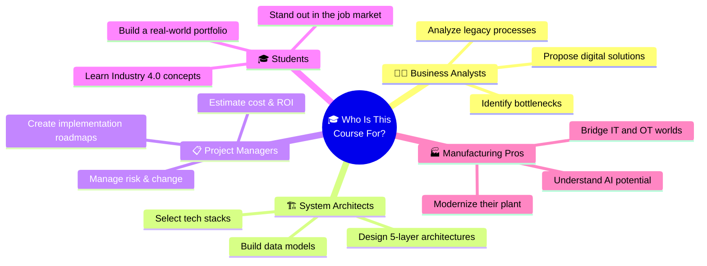

### Why This Course Matters

> Imagine walking into a paper factory today. You'll see clipboards hanging on machines, operators scribbling readings with pencils, managers drowning in spreadsheets, and maintenance crews running to fix machines that just broke — AGAIN. **This course teaches you how to replace ALL of that** with intelligent, connected, self-learning systems. That's not just a tech upgrade — it's a revolution.

---

## 2. Course Objectives — What You'll Master

By the end of this course, you will be able to:

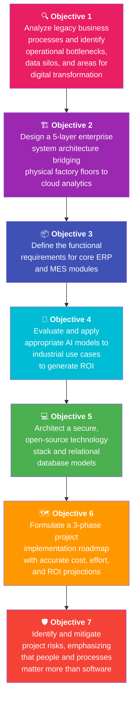

### Objectives in Simple Language

| # | Objective | In Simple Words |
|---|---|---|
| 1 | Analyze legacy business processes and identify operational bottlenecks, data silos, and areas for digital transformation | "Look at a messy factory, find where things break, and figure out what needs fixing" |
| 2 | Design a 5-layer enterprise system architecture bridging physical factory floors to cloud analytics | "Draw the master blueprint that connects machines on the floor to dashboards in the cloud" |
| 3 | Define the functional requirements for core ERP and MES (Manufacturing Execution System) modules | "List exactly what each software module needs to do — inventory, production, quality, finance, HR" |
| 4 | Evaluate and apply appropriate AI models (e.g., Predictive Maintenance, Quality Vision) to industrial use cases to generate ROI | "Pick the right AI tool for the right job — and prove it makes money" |
| 5 | Architect a secure, open-source technology stack and relational database models for enterprise systems | "Choose the best (and often free!) software tools and design how data is stored" |
| 6 | Formulate a 3-phase project implementation roadmap (Pilot, Scale, Optimize) with accurate cost, effort, and ROI projections | "Create a step-by-step plan with timelines, budgets, and proof it's worth the investment" |
| 7 | Identify and mitigate project risks, emphasizing the critical success factor that "people and processes matter more than software" | "Find what can go wrong, plan for it, and remember: the PEOPLE matter most" |

---

## 3. Your 15-Week Learning Journey — Visual Map

### The Big Picture — How Each Week Builds on the Last

> [!IMPORTANT]
> **Every weekly assignment acts as a building block for your Final Project.** Think of it like building a house — Week 1 is the land survey, Week 2 is the foundation, and by Week 15 you're handing over the keys. Nothing is wasted. Everything connects.

```mermaid
timeline
    title 🎓 Your 15-Week Transformation Journey
    section 🔍 PHASE A — Understanding the Problem (Weeks 1-2)
        Week 1 : 🏭 The Vision & Problem of Legacy Systems
               : Identify "Paper Hell" & siloed operations
               : Choose your project business
        Week 2 : 🏗️ The 5-Layer System Architecture
               : Physical → Data → Integration → Logic → AI
               : Draft your architecture diagram
    section 📦 PHASE B — Building the Core (Weeks 3-5)
        Week 3 : 📦 Supply Chain & Inventory
               : Real-time stock, automated POs
               : Map inventory workflows
        Week 4 : 🏭 MES & Quality Control
               : OEE, SPC, lot traceability
               : Define critical metrics
        Week 5 : 🔩 Maintenance, HR & Finance
               : CMMS, shift scheduling, costing
               : Cross-departmental integration
    section 💾 PHASE C — Data & Technology (Weeks 6-8)
        Week 6 : 📡 Data Architecture & Flow
               : Edge gateways, MQTT, Data Lakes
               : Create data flow diagrams
        Week 7 : 💻 Tech Stack Selection
               : Build vs Buy, open-source strategy
               : Justify your tech choices
        Week 8 : 🗄️ Database Design & ER Modeling
               : Relational design, core ERP tables
               : Design ER model with 5+ tables
    section 🧠 PHASE D — AI & Security (Weeks 9-11)
        Week 9 : 🔧 AI Part 1 — Predictive Maintenance & Vision
               : LSTM, XGBoost, YOLOv8, ResNet
               : Propose an AI use case
        Week 10 : 📈 AI Part 2 — Forecasting & RPA
                : Demand forecasting, RL optimization, RPA bots
                : Identify a process to automate
        Week 11 : 🔒 Security Architecture
                : IEC 62443, network segmentation, RBAC
                : Write a security policy
    section 🚀 PHASE E — Execution & Delivery (Weeks 12-15)
        Week 12 : 🗺️ Implementation Roadmap
                : Pilot → Scale → Optimize
                : Draft your phased roadmap
        Week 13 : 💰 Cost, Effort & ROI
                : Budgeting, payback periods
                : Estimate budget & ROI
        Week 14 : ⚠️ Risk Analysis & Change Management
                : Data quality, user resistance, scope creep
                : Draft mitigation strategies
        Week 15 : 🎤 Final Presentations
                : Executive pitching, peer feedback
                : Submit all deliverables
```

### How the Weeks Connect — Knowledge Building Blocks

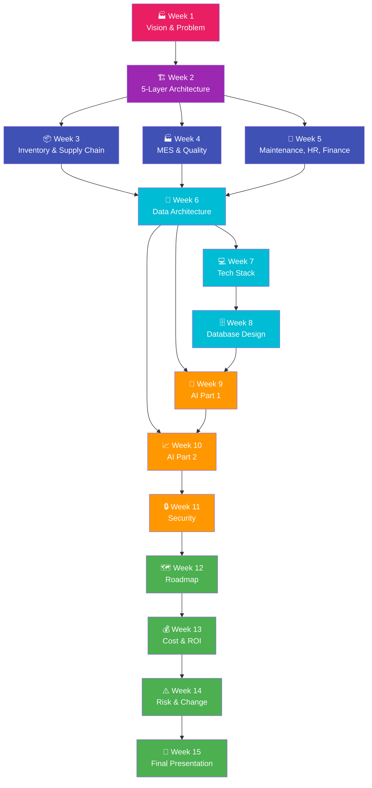

---

## 4. Weekly Breakdown — Deep Dive

---

### 📅 PHASE A — Understanding the Problem

---

### 🏭 Week 1: The Vision & Problem of Legacy Systems

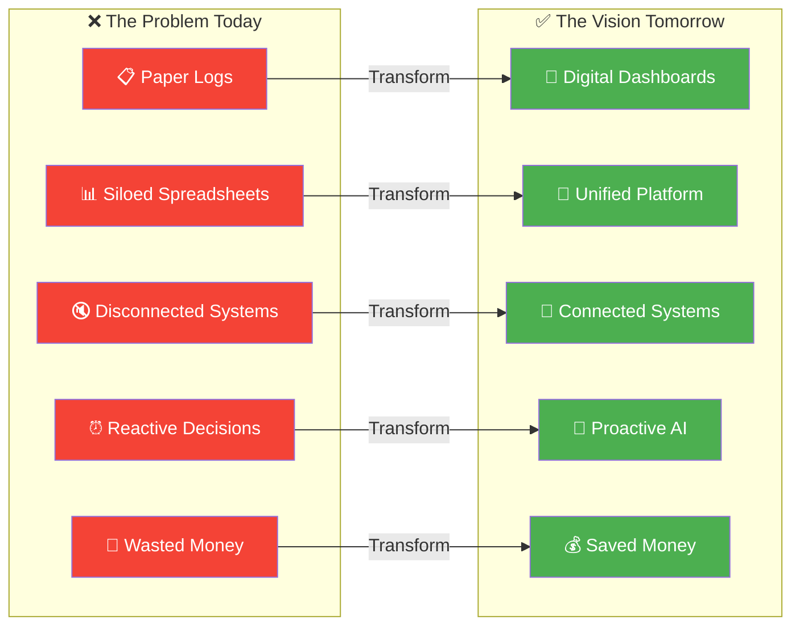

| Component | Details |
|---|---|
| **📌 Topic** | Identifying the "Paper Hell" & Siloed Operations |
| **📚 Main Concepts** | Business analysis fundamentals, replacing reactive decisions with proactive systems, unified digital platforms |
| **🎯 Activity** | Case study analyzing the costs of excessive energy use and unplanned downtime in a paper mill |
| **📝 Assignment** | Choose a traditional, non-digitized business for your final project. Write a 1-page problem statement detailing their current manual processes |

> **💡 Why This Matters:** Before you can build anything, you need to deeply understand what's broken. A doctor doesn't prescribe medicine without a diagnosis. This week, you become the "doctor" of a factory — examining its symptoms (delays, waste, breakdowns) and diagnosing the root causes (manual processes, disconnected data, no visibility).

> [!TIP]
> **Pro Tip for Your Assignment:** When choosing your business, pick one you can actually visit or interview people from. Real-world observations (seeing the paper logbooks, watching operators re-enter data) make your final project 10x more compelling.

---

### 🏗️ Week 2: The 5-Layer System Architecture

| Component | Details |
|---|---|
| **📌 Topic** | How Everything Connects (From Sensors to Dashboards) |
| **📚 Main Concepts** | Physical Layer, Data Layer, Integration Layer, Business Logic, and AI & Analytics Layer |
| **🎯 Activity** | Match real-world factory components (like PLCs, databases, and ML models) to their appropriate architectural layer |
| **📝 Assignment** | Draft a high-level 5-layer architecture diagram for your chosen business |

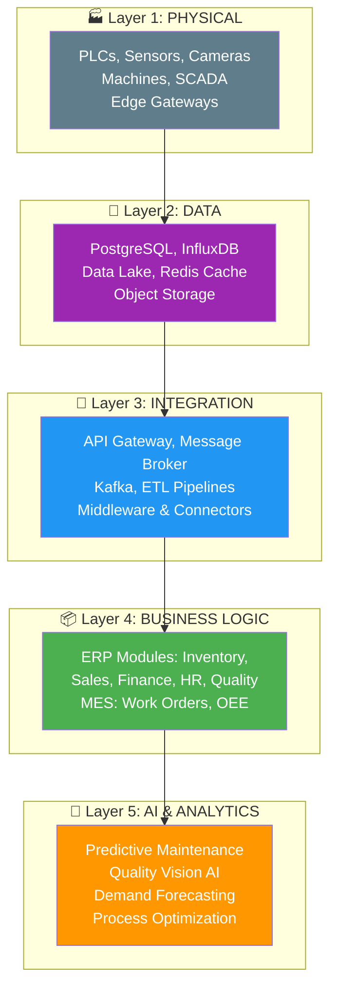

> **💡 Why This Matters:** The 5-layer architecture is the **master blueprint** that guides EVERYTHING you build. It's like learning the skeleton of the human body before studying medicine. Every future week plugs into one of these five layers. Get this right, and the rest of the course clicks into place.

| Layer | What Goes Here | Real-World Example |
|---|---|---|
| **Layer 1: Physical** | Machines, sensors, cameras, PLCs, SCADA | A temperature sensor on a paper dryer sending readings every second |
| **Layer 2: Data** | Databases, data lakes, caches | InfluxDB storing 10 million sensor readings per day |
| **Layer 3: Integration** | APIs, message brokers, ETL pipelines | Kafka streaming machine events to the MES in real-time |
| **Layer 4: Business Logic** | ERP & MES software modules | Inventory module automatically triggering a purchase order when pulp stock drops below threshold |
| **Layer 5: AI & Analytics** | ML models, BI dashboards, predictions | An LSTM model predicting that a motor bearing will fail in 5 days |

---

### 📅 PHASE B — Building the Core

---

### 📦 Week 3: Core ERP Components — Supply Chain & Inventory

| Component | Details |
|---|---|
| **📌 Topic** | Digital Inventory & Procurement |
| **📚 Main Concepts** | Real-time stock levels, multi-warehouse support, automated PO creation, 3-way matching |
| **🎯 Activity** | Exercise on reducing excess inventory by 15-25% using automated reorder thresholds |
| **📝 Assignment** | Map out the ideal inventory and supply chain workflows needed for your project |

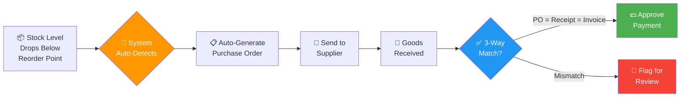

> **💡 Why This Matters:** Inventory is the lifeblood of any factory. Too much stock = wasted money sitting on shelves. Too little = production stops. This week teaches you how intelligent systems keep the perfect balance — automatically. The 3-way matching concept alone (PO vs. Receipt vs. Invoice) prevents millions in procurement fraud every year.

> [!TIP]
> **Key Takeaway:** The goal isn't just tracking stock — it's **automating decisions**. When pulp drops to 500 kg, the system doesn't wait for a manager to notice; it creates a PO instantly. That's the power of a digital supply chain.

---

### 🏭 Week 4: MES & Quality Control Operations

| Component | Details |
|---|---|
| **📌 Topic** | The "Air Traffic Controller" of the Factory Floor |
| **📚 Main Concepts** | OEE (Overall Equipment Effectiveness), downtime tracking, Statistical Process Control (SPC), lot traceability |
| **🎯 Activity** | Calculate OEE for a hypothetical machine and propose strategies to increase it by 10-20% |
| **📝 Assignment** | Define 3 critical operational metrics (like OEE) for your business project and explain how you will track them |

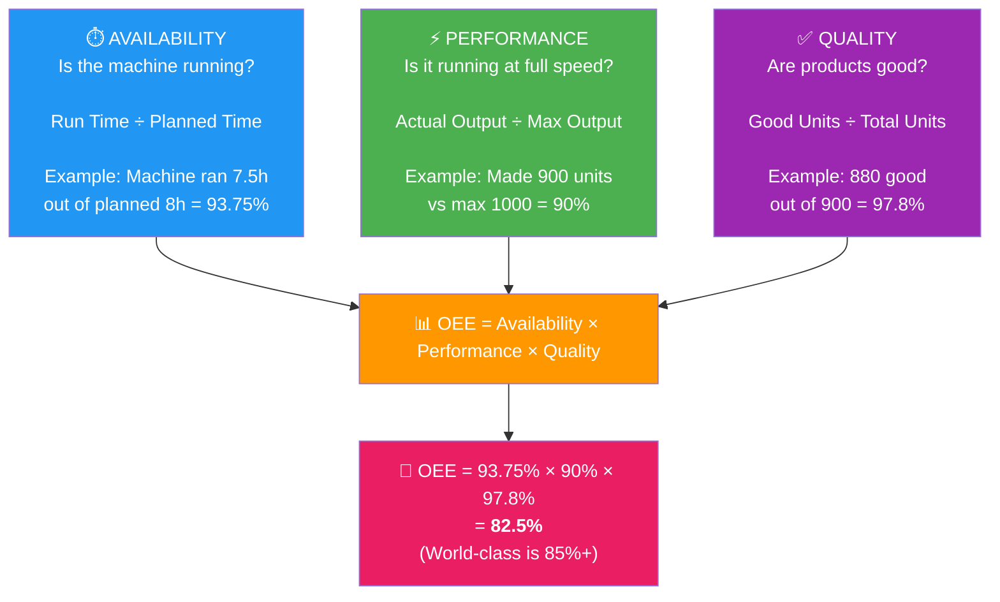

> **💡 Why This Matters:** OEE is the single most important number in any factory. It tells you exactly how well your machines are performing across three dimensions. If your OEE is 65% (common in non-digitized plants), that means 35% of your potential production is being wasted! MES makes this visible, and visibility is the first step to improvement.

---

### 🔩 Week 5: Supporting Systems — Maintenance, HR & Finance

| Component | Details |
|---|---|
| **📌 Topic** | Connecting the Backbone of the Business |
| **📚 Main Concepts** | Preventive vs. predictive maintenance, shift scheduling, real-time product costing (cost per ton), General Ledger integration |
| **🎯 Activity** | Map out how the Finance module acts as a hub touching Inventory, MES, HR, and Sales |
| **📝 Assignment** | Outline the cross-departmental data integration points for your project |

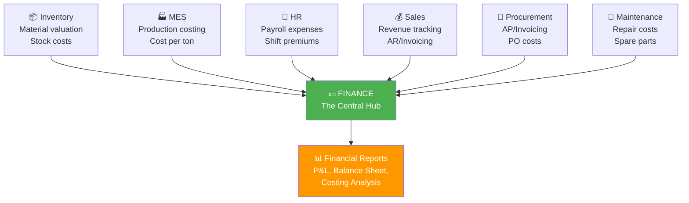

> **💡 Why This Matters:** Finance isn't just about accounting — it's the nervous system that connects EVERYTHING. When a machine runs overtime (Maintenance cost), that affects Payroll (HR cost), which affects Product Costing (Finance), which affects Pricing (Sales). This week shows you how all these dominoes connect.

| Concept | Preventive Maintenance | Predictive Maintenance |
|---|---|---|
| **When?** | On a fixed schedule (every 30 days) | When data predicts a failure is coming |
| **Analogy** | Changing your car oil every 5,000 km | Changing oil when sensors detect degradation |
| **Cost** | Sometimes wasteful (replacing good parts) | Highly efficient (just-in-time) |
| **Requires** | Calendar reminders | AI models + sensor data |

---

### 📅 PHASE C — Data & Technology

---

### 📡 Week 6: Data Architecture & Flow

| Component | Details |
|---|---|
| **📌 Topic** | Moving Data from Machines to the Cloud |
| **📚 Main Concepts** | Edge Gateways, MQTT/OPC-UA, Data Lakes, InfluxDB (Time-Series) vs. PostgreSQL (Relational) |
| **🎯 Activity** | Map the journey of a single vibration reading from a machine sensor to a predictive maintenance dashboard |
| **📝 Assignment** | Create a data flow diagram for your business project showing data origin to storage |

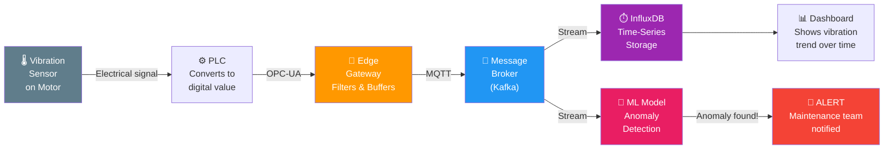

> **💡 Why This Matters:** Data is the "fuel" for AI. Without a proper architecture to collect, transport, store, and process data, even the best AI model is useless. This week teaches you the "plumbing" of a digital factory — how a single reading travels from a physical sensor all the way to a prediction on a manager's phone.

| Database Type | Best For | Example |
|---|---|---|
| **InfluxDB (Time-Series)** | Sensor data that arrives every second with timestamps | Temperature readings: `{time: 10:30:01, machine: M1, temp: 85.2°C}` |
| **PostgreSQL (Relational)** | Business data with relationships between entities | Orders: `{order_id: 1001, customer: "ABC Corp", product: "A4 Paper"}` |
| **Data Lake** | EVERYTHING — raw, processed, structured, unstructured | All sensor data + orders + images + logs = one massive storage |
| **Redis (Cache)** | Data that needs instant access (current machine status) | `{machine_M1_status: "RUNNING", speed: 450rpm}` |

---

### 💻 Week 7: Tech Stack Selection & Open-Source Strategy

| Component | Details |
|---|---|
| **📌 Topic** | Build vs. Buy Decisions |
| **📚 Main Concepts** | Hybrid tech stack models, open-source cost savings (saving $500K-$2M), frontend/backend frameworks |
| **🎯 Activity** | Compare building a custom MES on open-source tools versus buying a proprietary SAP/Oracle solution |
| **📝 Assignment** | Recommend and justify a software tech stack for your final project |

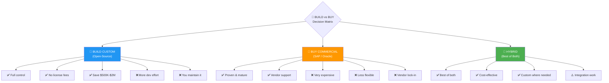

> **💡 Why This Matters:** Choosing the wrong tech stack can cost a company millions — or doom a project to failure. This week teaches you how to think critically about technology choices: when open-source saves $500K-$2M, when a commercial product is worth the price, and when a hybrid approach gives you the best of both worlds. This is a skill that makes Business Analysts and Architects invaluable.

---

### 🗄️ Week 8: Database Design & ER Modeling

| Component | Details |
|---|---|
| **📌 Topic** | Structuring Enterprise Data |
| **📚 Main Concepts** | Relational design, core ERP tables (ITEM, MACHINE, SENSOR, WORK_ORDER) |
| **🎯 Activity** | Draw an Entity-Relationship (ER) diagram connecting a WORK_ORDER to an ITEM and a MACHINE |
| **📝 Assignment** | Design an ER model (minimum 5 interconnected tables) for your final project |

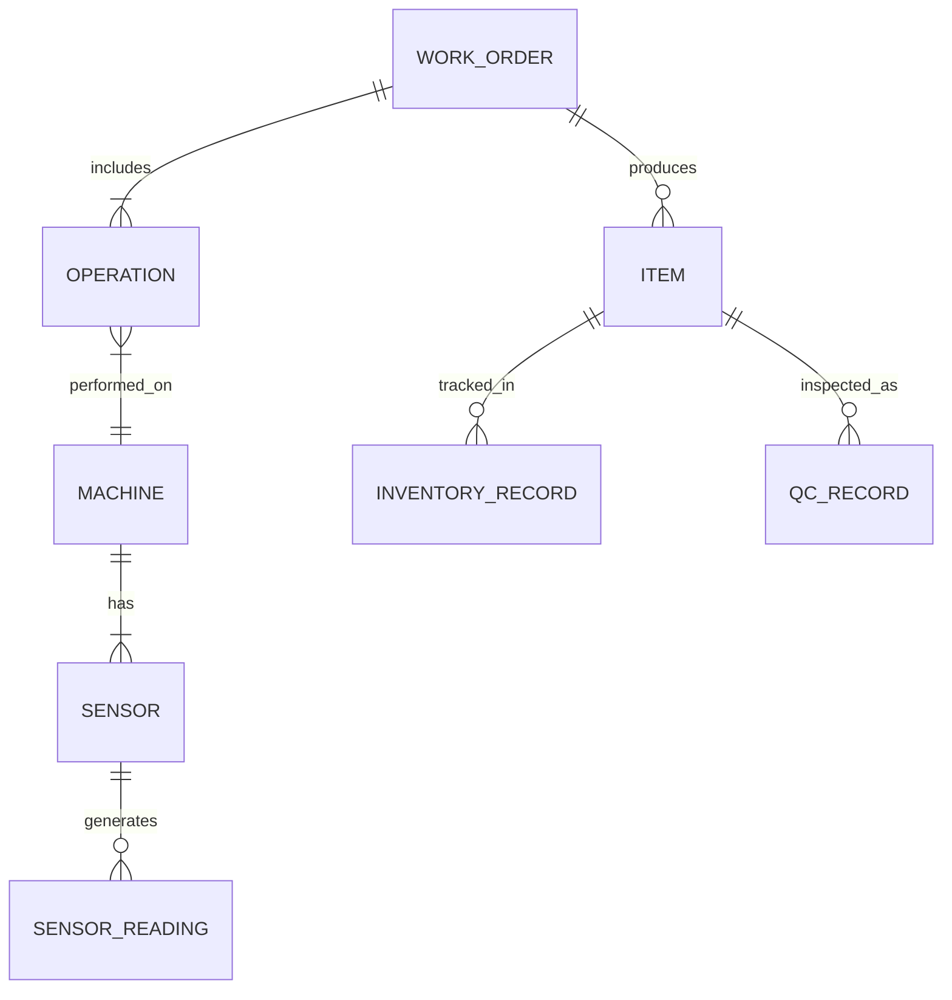

> **💡 Why This Matters:** The database is the **foundation** of every software system. A poorly designed database creates problems that echo through every module — slow queries, inconsistent data, impossible reports. An ER diagram is how you plan this foundation BEFORE writing a single line of code. The four tables you learn here (ITEM, MACHINE, SENSOR, WORK_ORDER) are the heart of ANY manufacturing system.

### How to Read an ER Diagram (Quick Guide)

| Symbol | Meaning | Example |
|---|---|---|
| `||--||` | One-to-one | One MACHINE has one LOCATION |
| `||--|{` | One-to-many | One WORK_ORDER includes many OPERATIONs |
| `||--o{` | One-to-zero-or-many | One ITEM has zero or many QC_RECORDs |
| `}|--||` | Many-to-one | Many OPERATIONs performed on one MACHINE |

---

### 📅 PHASE D — AI & Security

---

### 🧠 Week 9: The AI Layer Part 1 — Predictive Maintenance & Vision AI

| Component | Details |
|---|---|
| **📌 Topic** | Implementing High-Priority AI Models |
| **📚 Main Concepts** | LSTM/XGBoost for failure prediction, YOLOv8/ResNet for visual defect classification, training data requirements |
| **🎯 Activity** | Analyze the ROI of replacing manual quality checks (70% accuracy) with Vision AI (95%+ accuracy) |
| **📝 Assignment** | Propose one predictive AI use case for your project detailing how it works, the data needed, and the expected ROI |

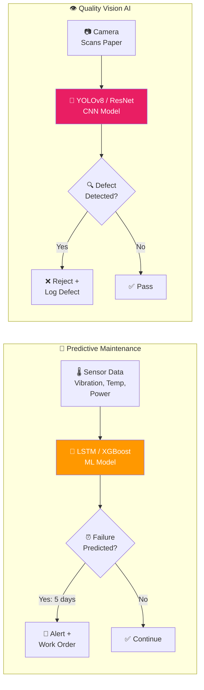

> **💡 Why This Matters:** These are the two HIGHEST-ROI AI use cases in manufacturing. Predictive maintenance alone can reduce unplanned downtime by 30-50%. Vision AI catches defects that human eyes miss — at speeds humans can't match. Learning to evaluate and propose these models makes you incredibly valuable to any manufacturing company.

### ROI Comparison — The Activity Explained

| Metric | Manual Quality Checks | Vision AI |
|---|---|---|
| **Accuracy** | ~70% | 95%+ |
| **Speed** | 1 check per minute | 100+ checks per second |
| **Consistency** | Varies (fatigue, distraction) | Always the same |
| **Cost** | Ongoing labor cost | One-time setup + maintenance |
| **Coverage** | Sample-based (check 1 in 100) | 100% of production |

---

### 📈 Week 10: The AI Layer Part 2 — Forecasting, Optimization & RPA

| Component | Details |
|---|---|
| **📌 Topic** | Business Intelligence & Automated Admin |
| **📚 Main Concepts** | Demand forecasting, Process optimization via Reinforcement Learning, Robotic Process Automation (RPA) for admin tasks |
| **🎯 Activity** | Case study on using RPA to achieve a 30% labor cost reduction in invoice processing |
| **📝 Assignment** | Identify one manual administrative process in your project to automate using RPA bots |

```mermaid
graph TD
    subgraph "📈 Demand Forecasting"
        DF1["📊 Historical Sales Data<br/>+ Seasonality<br/>+ Market Trends"] --> DF2["🧠 XGBoost / LSTM"]
        DF2 --> DF3["📋 Next Month:<br/>Need 500 tons of<br/>Grade A Paper"]
    end

    subgraph "⚙️ Process Optimization"
        PO1["🌡️ Machine Parameters<br/>Speed, Temp, Pressure"] --> PO2["🧠 Reinforcement<br/>Learning Agent"]
        PO2 --> PO3["🎯 Optimal Settings:<br/>Speed=420, Temp=82°C<br/>Saves 15% energy"]
    end

    subgraph "🤖 RPA Bots"
        RPA1["📧 Invoice Email<br/>Arrives"] --> RPA2["🤖 Bot Reads<br/>Invoice PDF"]
        RPA2 --> RPA3["📝 Extracts Data<br/>Amount, Vendor, Items"]
        RPA3 --> RPA4["💻 Enters into<br/>ERP System"]
        RPA4 --> RPA5["✅ Auto-Reconciles<br/>with PO"]
    end

    style DF2 fill:#2196F3,color:#fff
    style PO2 fill:#4CAF50,color:#fff
    style RPA2 fill:#FF9800,color:#fff
```

> **💡 Why This Matters:** AI isn't just about machines — it's about smarter business decisions too. Demand forecasting prevents the costly mistakes of over-production or under-production. RPA is the "low-hanging fruit" of automation — it can start saving money from Day 1 with minimal technical complexity. The case study on 30% labor cost reduction in invoice processing is a real-world number that companies achieve regularly.

---

### 🔒 Week 11: Security Architecture in Industry 4.0

| Component | Details |
|---|---|
| **📌 Topic** | Protecting the Digital Factory |
| **📚 Main Concepts** | Defense-in-Depth, IEC 62443 standards, IT/OT network segmentation, Role-Based Access Control (RBAC) |
| **🎯 Activity** | Design a secure network topology that isolates factory machines (OT) from office WiFi (IT) |
| **📝 Assignment** | Write a brief security policy mitigating the top 3 cyber threats for your project |

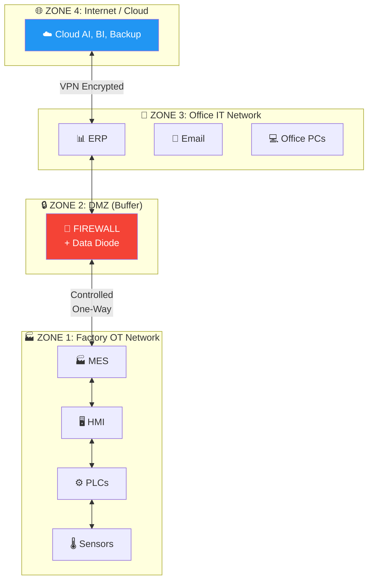

> **💡 Why This Matters:** When you connect a factory to the internet (which is exactly what Industry 4.0 does), you open the door to hackers. In 2021, a cyberattack on a water treatment plant tried to poison the water supply by changing chemical levels remotely. The IEC 62443 standard and network segmentation you learn this week are what prevents those nightmares. This isn't just IT security — it's safety.

| Concept | What It Means (Simple) |
|---|---|
| **Defense-in-Depth** | Multiple layers of security, like a castle with walls, a moat, guards, AND locked doors |
| **IEC 62443** | International standard for securing industrial systems — the "rulebook" for factory cybersecurity |
| **IT/OT Segmentation** | Keeping office computers and factory machines on completely separate networks |
| **RBAC** | Each person can only access what their role requires — operators can't change financial settings |

---

### 📅 PHASE E — Execution & Delivery

---

### 🗺️ Week 12: Project Implementation Roadmap

| Component | Details |
|---|---|
| **📌 Topic** | Executing a Phased Digital Transformation |
| **📚 Main Concepts** | Phase 1: Pilot (Quick Wins), Phase 2: Scale (Full Deployment), Phase 3: Optimize (Advanced AI) |
| **🎯 Activity** | Plan a 6-week "Discovery & Audit" phase and establish a KPI baseline |
| **📝 Assignment** | Draft a phased implementation roadmap for your business project |

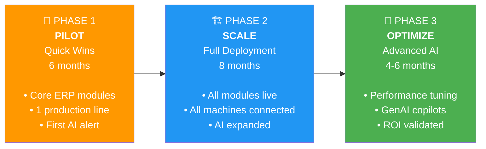

> **💡 Why This Matters:** The biggest mistake in digital transformation is trying to do everything at once. That's how projects fail, budgets explode, and teams burn out. The 3-phase approach (Pilot → Scale → Optimize) is how experienced project managers deliver complex projects — small wins first build confidence, then expand. This week teaches you the discipline of phased delivery.

---

### 💰 Week 13: Estimating Cost, Effort, & ROI

| Component | Details |
|---|---|
| **📌 Topic** | Building the Business Case |
| **📚 Main Concepts** | Budgeting software, infrastructure, and team costs. Calculating annual savings (energy, downtime, scrap) to determine payback periods |
| **🎯 Activity** | Calculate the payback period for a $2.8M investment that yields $2.8M in annual savings |
| **📝 Assignment** | Estimate a simplified budget and ROI projection for your final project |

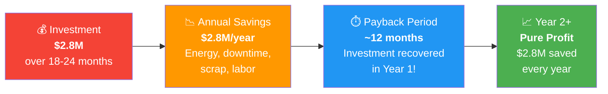

> **💡 Why This Matters:** A brilliant technical design means nothing if you can't convince executives to fund it. This week teaches you the language of business: ROI, payback periods, cost-benefit analysis. When you can say "This $2.8M investment pays for itself in 12 months and saves $2.8M every year after that" — that's how you get a YES.

### The Activity — Worked Example

| Item | Calculation |
|---|---|
| **Total Investment** | $2,800,000 |
| **Annual Savings** | $2,800,000 |
| **Payback Period** | Investment ÷ Annual Savings = $2.8M ÷ $2.8M = **1 year** |
| **5-Year ROI** | (Savings × 5 - Investment) ÷ Investment = ($14M - $2.8M) ÷ $2.8M = **400%** |

---

### ⚠️ Week 14: Risk Analysis & Change Management

| Component | Details |
|---|---|
| **📌 Topic** | Why Projects Fail and How to Save Them |
| **📚 Main Concepts** | Data quality issues, user resistance, integration complexity, scope creep |
| **🎯 Activity** | Create a risk register detailing how to handle factory workers who refuse to stop using paper logs |
| **📝 Assignment** | Identify 3 major implementation risks for your final project and draft a mitigation strategy |

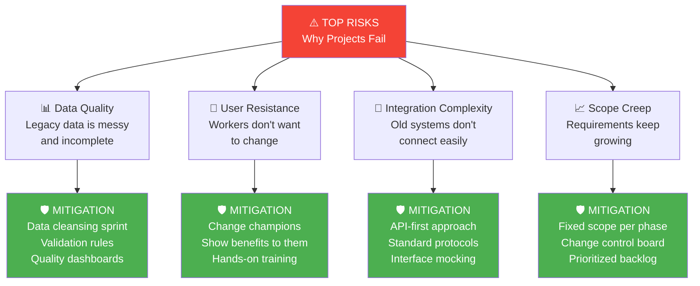

> **💡 Why This Matters:** Here's a sobering truth: **over 50% of ERP projects fail or significantly exceed budget**. The #1 reason isn't technology — it's PEOPLE. Factory workers who've used paper logs for 20 years don't want to learn new software. Managers who built empires on spreadsheets feel threatened. This week teaches you the human side of technology — arguably the most important skill of all.

> [!CAUTION]
> **The Critical Success Factor:** "People and processes matter more than software." This single sentence from the course objectives is worth memorizing. The best system in the world fails if people refuse to use it.

---

### 🎤 Week 15: Final Presentations & Project Reviews

| Component | Details |
|---|---|
| **📌 Topic** | Communicating the Blueprint |
| **📚 Main Concepts** | Executive pitching, translating technical concepts to business value |
| **🎯 Activity** | Live class presentations and peer feedback |
| **📝 Assignment** | Submit all Final Deliverables |

> **💡 Why This Matters:** You can design the most brilliant system architecture in the world — but if you can't COMMUNICATE it to executives, stakeholders, and factory workers in their language, it stays on paper. This week is where you prove you can translate technical concepts into business value. It's the skill that separates good engineers from great leaders.

---

## 5. Final Project Instructions

### 🎯 Goal

Acting as a **Lead Business Analyst**, you will analyze a traditional business and propose a comprehensive digital transformation and AI roadmap.

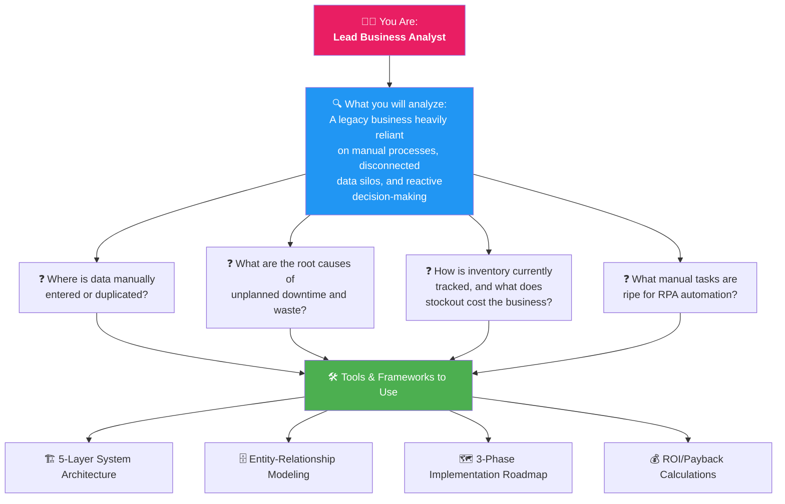

### What Your Presentation Should Include

| Element | What to Show |
|---|---|
| **Before vs. After** | A compelling comparison of the business today versus after your transformation |
| **Technical Stack** | A clear recommendation of which technologies to use and WHY |
| **AI Use Cases** | High-priority AI applications with expected ROI |
| **Risk Mitigation** | A realistic strategy for handling user resistance and other risks |

---

## 6. Final Deliverables

At the end of **Week 15**, students must submit the following portfolio:

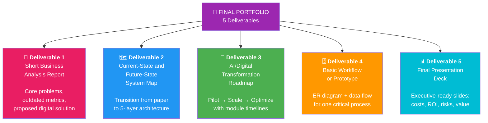

### Deliverables Explained in Detail

| # | Deliverable | What It Contains | Skills Demonstrated |
|---|---|---|---|
| **1** | **Short Business Analysis Report** | Detailing the core problems, outdated metrics, and the proposed digital solution | Business Analysis, Problem Identification, Solution Design |
| **2** | **Current-State and Future-State System Map** | Visualizing the transition from paper/siloed software to the 5-layer integrated architecture | System Architecture, Visual Communication, Strategic Thinking |
| **3** | **AI/Digital Transformation Roadmap** | A phased timeline (Pilot, Scale, Optimize) showing when specific modules and AI capabilities will go live | Project Planning, Phased Delivery, AI Strategy |
| **4** | **Basic Workflow or Prototype** | An ER database diagram alongside a proposed data flow for one critical process (e.g., automated inventory reordering) | Database Design, Data Flow Modeling, Technical Documentation |
| **5** | **Final Presentation Deck** | An executive-ready slide deck summarizing the project's costs, projected ROI, risks, and ultimate business value | Executive Communication, ROI Analysis, Risk Management |

---

## 7. Impact — How This Learning Transforms Traditional Manufacturing

---

### 🏭 The Transformation Story: From Paper Mill to Smart Factory

This course isn't just about learning technology — it's about **fundamentally changing how traditional manufacturing companies operate, compete, and survive** in the modern world. Here's the real impact:

---

### Before vs. After — The Complete Transformation

```mermaid
graph LR
    subgraph "❌ BEFORE: Traditional Paper Mill"
        direction TB
        B1["📋 Paper clipboards<br/>on every machine"]
        B2["📊 50+ Excel files<br/>nobody trusts"]
        B3["📞 Phone calls to check<br/>if stock is available"]
        B4["🔧 Fix machines<br/>AFTER they break"]
        B5["👁️ Human inspectors miss<br/>30% of defects"]
        B6["📅 Monthly reports<br/>too late to act"]
        B7["💸 15-20% energy<br/>wasted"]
        B8["🏢 Departments work<br/>in isolation"]
    end

    subgraph "✅ AFTER: Smart Factory (Industry 4.0)"
        direction TB
        A1["📱 Real-time dashboards<br/>accessible anywhere"]
        A2["🔗 One unified platform<br/>single source of truth"]
        A3["🤖 Automatic inventory<br/>tracking & reordering"]
        A4["🧠 AI predicts failures<br/>3-5 days in advance"]
        A5["📷 Vision AI catches<br/>95%+ defects instantly"]
        A6["⚡ Live KPI dashboards<br/>act in real-time"]
        A7["🌱 AI optimizes energy<br/>saving 15-20%"]
        A8["🤝 Fully connected<br/>departments"]
    end

    B1 -->|"TRANSFORM"| A1
    B2 -->|"TRANSFORM"| A2
    B3 -->|"TRANSFORM"| A3
    B4 -->|"TRANSFORM"| A4
    B5 -->|"TRANSFORM"| A5
    B6 -->|"TRANSFORM"| A6
    B7 -->|"TRANSFORM"| A7
    B8 -->|"TRANSFORM"| A8

    style B1 fill:#f44336,color:#fff
    style B2 fill:#f44336,color:#fff
    style B3 fill:#f44336,color:#fff
    style B4 fill:#f44336,color:#fff
    style B5 fill:#f44336,color:#fff
    style B6 fill:#f44336,color:#fff
    style B7 fill:#f44336,color:#fff
    style B8 fill:#f44336,color:#fff
    style A1 fill:#4CAF50,color:#fff
    style A2 fill:#4CAF50,color:#fff
    style A3 fill:#4CAF50,color:#fff
    style A4 fill:#4CAF50,color:#fff
    style A5 fill:#4CAF50,color:#fff
    style A6 fill:#4CAF50,color:#fff
    style A7 fill:#4CAF50,color:#fff
    style A8 fill:#4CAF50,color:#fff
```

---

### 📊 The Numbers That Tell the Story

| KPI | Traditional Factory | After Transformation | Impact |
|---|---|---|---|
| **OEE (Overall Equipment Effectiveness)** | 60-65% | 80-85% | **+20% more production from the SAME machines** |
| **Unplanned Downtime** | 15% of production time | 3-5% of production time | **66-80% reduction — machines don't "surprise break" anymore** |
| **Quality Defect Rate** | 5-8% (human inspectors) | 1-2% (AI Vision) | **Scrap & rework costs cut by 50-75%** |
| **Energy Consumption** | Baseline | -15-20% | **$200K-$500K saved per year** |
| **Inventory Accuracy** | ~70% (manual counts) | 99%+ (real-time tracking) | **No more stockouts or over-purchasing** |
| **Report Availability** | End of month (30 days late) | Real-time (instant) | **Decisions based on NOW, not last month** |
| **Invoice Processing Time** | 3-5 days (manual entry) | <1 hour (RPA bots) | **30% admin labor cost reduction** |
| **Maintenance Cost** | Reactive = expensive | Predictive = efficient | **20-30% cost reduction** |
| **Annual Savings** | — | **$1.35M - $2.8M** | **Pays for itself in 12-24 months** |

---

### 🔄 How Each Week's Learning Creates Impact

```mermaid
graph TD
    subgraph "🎓 What You Learn"
        L1["Week 1: See the problem"]
        L3["Week 3: Digital inventory"]
        L4["Week 4: MES & OEE"]
        L6["Week 6: Data architecture"]
        L9["Week 9: Predictive AI"]
        L11["Week 11: Security"]
        L12["Week 12: Phased rollout"]
    end

    subgraph "🏭 How It Changes the Factory"
        I1["Management sees what's broken<br/>and commits to change"]
        I3["No more stockouts,<br/>25% less excess inventory"]
        I4["OEE jumps from 65% to 85%<br/>+20% more production"]
        I6["Data flows from sensors<br/>to dashboards in seconds"]
        I9["Machines don't break<br/>unexpectedly anymore"]
        I11["Factory is protected from<br/>cyberattacks"]
        I12["Transformation happens<br/>smoothly, not chaotically"]
    end

    L1 --> I1
    L3 --> I3
    L4 --> I4
    L6 --> I6
    L9 --> I9
    L11 --> I11
    L12 --> I12

    style L1 fill:#2196F3,color:#fff
    style L3 fill:#2196F3,color:#fff
    style L4 fill:#2196F3,color:#fff
    style L6 fill:#2196F3,color:#fff
    style L9 fill:#2196F3,color:#fff
    style L11 fill:#2196F3,color:#fff
    style L12 fill:#2196F3,color:#fff
    style I1 fill:#4CAF50,color:#fff
    style I3 fill:#4CAF50,color:#fff
    style I4 fill:#4CAF50,color:#fff
    style I6 fill:#4CAF50,color:#fff
    style I9 fill:#4CAF50,color:#fff
    style I11 fill:#4CAF50,color:#fff
    style I12 fill:#4CAF50,color:#fff
```

---

### 🌍 The Bigger Picture — Why This Matters for the Industry

#### The Survival Question

> Traditional paper manufacturing companies face a stark reality: **digitize or die**. Global competition, rising energy costs, tighter environmental regulations, and customers demanding faster delivery are squeezing margins. Companies that still rely on paper logs and siloed spreadsheets are losing 15-35% of their potential productivity — every single day.

#### What This Course's Graduates Can Do

```mermaid
mindmap
  root((🎓 Graduate<br/>Impact))
    🏭 For the Factory
      Replace paper logs with digital dashboards
      Connect every machine to one platform
      Deploy AI that predicts and prevents
      Automate admin tasks that waste time
      Cut costs by $1-3M annually
    💼 For Their Career
      Business Analyst role readiness
      System Architect capabilities
      Project Manager skills
      Industry 4.0 expertise
      AI literacy for manufacturing
    🌍 For the Industry
      Bridge the IT/OT skills gap
      Accelerate digital transformation
      Reduce environmental waste
      Make factories safer
      Keep manufacturing competitive
```

#### The Ripple Effect of Transformation

| Dimension | Traditional Approach | After Digital Transformation |
|---|---|---|
| **Decision Making** | Based on gut feeling, outdated reports, and "we've always done it this way" | Based on real-time data, AI predictions, and evidence |
| **Workforce** | Repetitive manual tasks, paper forms, walking to check machines | Higher-value work, monitoring dashboards, managing exceptions |
| **Sustainability** | Excessive energy use, high scrap rates, wasteful processes | 15-20% less energy, 50% less scrap, optimized processes |
| **Competitiveness** | Slow to respond, high costs, quality inconsistencies | Agile, cost-efficient, consistently high quality |
| **Safety** | Reactive safety protocols, incident-based learning | Predictive safety alerts, anomaly detection, proactive protocols |
| **Customer Experience** | "Let me check and call you back tomorrow" | Real-time order tracking, accurate delivery dates, instant answers |
| **Scalability** | Adding capacity = building new buildings | Adding capacity = optimizing what you have first |

---

### 🎯 The Ultimate Impact Statement

> [!IMPORTANT]
> **This course creates people who can walk into ANY traditional manufacturing company — whether it makes paper, textiles, food, chemicals, or metals — and design a complete roadmap to transform it from a 20th-century operation into a 21st-century smart factory.** The 5-Layer Architecture, the 3-Phase Roadmap, and the AI prioritization framework you learn here are **universally applicable**. You're not just learning about paper mills — you're learning a methodology that works across ALL of manufacturing.

### The Transformation in One Image

```mermaid
graph LR
    BEFORE["🏭 TRADITIONAL<br/>FACTORY<br/><br/>📋 Paper Logs<br/>📊 Spreadsheets<br/>🔧 Reactive Fixes<br/>👁️ Manual Checks<br/>📅 Monthly Reports<br/>💸 Hidden Costs<br/><br/>OEE: 65%<br/>Downtime: 15%<br/>Defects: 8%"] -->|"15-Week<br/>Learning<br/>Journey<br/>+<br/>18-24 Month<br/>Implementation"| AFTER["🚀 SMART<br/>FACTORY<br/><br/>📱 Live Dashboards<br/>🔗 Unified Platform<br/>🧠 AI Predictions<br/>📷 Vision AI<br/>⚡ Real-Time Data<br/>💰 Transparent Costs<br/><br/>OEE: 85%<br/>Downtime: 5%<br/>Defects: 2%"]

    style BEFORE fill:#f44336,color:#fff
    style AFTER fill:#4CAF50,color:#fff
```

---

> [!TIP]
> **Remember:** The technology is the tool. YOU are the architect. The factory workers, managers, and executives are the people who make it real. This course gives you the complete toolkit — now go build the future of manufacturing. 🚀

---

*Document Version: 1.0 | Course: Industry 4.0 Mastery: The Industrial AI & ERP Blueprint | 15-Week Program*
*All original course content preserved as provided — enhanced with visual explanations and impact analysis*
